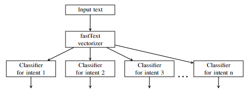
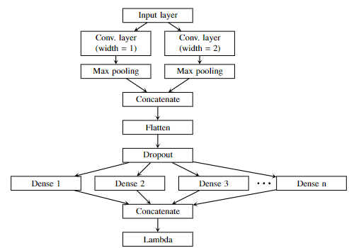

# PIP3_2.1_MultiIntent
Scripts for training the Multi-intent detection model

## Usage
To train the Multi-intent detection model the train and test data must be prepared. The data are included in the two column TAB separated file. Each line contains an utterance example in the first column and the intent identifier in the second column.

Training is performed with the script . All infomation used for the training is specified in the  file.

Parameters in the *config.ini* file:

- datadir: directory where different statistics will be stored
- resdir: result directory
- input_file_train: file with training data
- input_file_test: file with test data
- dsName: name of the dataset
- lang: language of the data
- xval: number of x-validation steps; testing is done on test data if xval=0
- multi: if true detects multiple intents per example
- verNr: model version - 0, 1, or 2
- epochs: number of epochs model must be training

Folder *Classifier* contains class for the classifier and functions for training and validation.

Folder *DataPreprocessing* contains functions for data preprocessing.

Folder *DataVectorizing* contains class for connecting to FastText vectorizer.

Folder *ResultStats* contains functions for statistics calculation.

## Architecture
We have implemented 3 different multi-intent detection models

### Version 0 - Many Single-Intent Models

Each model is a classifier with two output classes that predicts if there is a particular intent or if this intent is absent.

### Version 1 - Single Multi-Intent Model with Many Dense layers

All models are joined in a single model with a common convolution layer and n dense layers with 2 units for each intent. Like with the previous
approach, each of the dense layers has 2 output classes - either the intent exists or not. Outputs of the dense layers are concatenated, thus the output size of the concatenation
layer is 2 × n. The next Lambda layer throws out every other output leaving only those who signalize the existence of the intent.

### Version 2 - Single Multi-Intent Model with a Common Dense Layer

For this architecture, we use a common dense layer for all intents, but instead of the softmax activation function we use the sigmoid activation function that allows us to
detect if an intent is in an utterance regardless of other intents.

## Results

## Acknowledgment
This prototype is created in activity 2.1 of the project "AI Assistant for Multilingual Meeting Management" (No. of the Contract/Agreement: 1.1.1.1/19/A/082).

@Tilde, 2022
